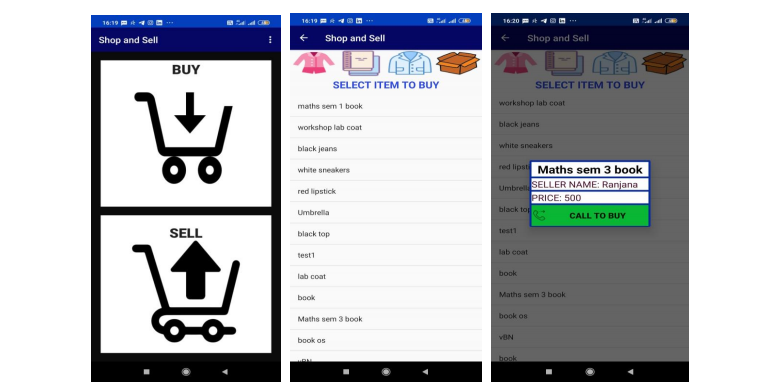

**Shop and Sell - Android Project**
-----------------------------------

The Project Uses

 - Android Studio
 - Java
 - XML
 - PHP

----------

Description
-----------

In the app there are two options for the user either to sell their own item or to buy the items uploaded by other people. To sell the person need to add his details and the item details and agree to the conditions. Once the item is uploaded it can viewed by others in the buy option.
To buy a product click on the buy option and select the item you are interested in buying.Select it see the price and buyer name and call the buyer to buy the product.
A new user can know about the app in the “About” option in the menu and for any problem with the app a person can mail us his/her query in the “Help” option in the menu.

----------

Installation
------------
 1. Install android studio
 3. check dependecies and gradle
 4. clone and run the project
 5. To build your own database you will need to create one

----------

Usage
-----
Refer the following diagram to understand the flow of the application

----------

Screenshots of the Application
-------
The Buy option Activity with details of seller and to call the seller

The Sell option Activity to add your items to sell

About the App and the Mail option with which you can mail for query

